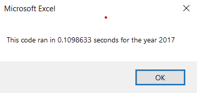
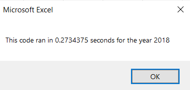

# FACTORS OF SUCCESSFUL KICKSTARTER PROJECTS

## Overview of Project
Steve's clients who are also his parents wanted to invest into DQ New Energy Corp to support alternative energy. However, to make the portfolio safer, Steve wanted to research and analyze various alaternative energy companies to optimize his client's portfolio. 

## Results
### Stock performance in 2017 and 2018
In 2017, all selected energy companies performed well: 4 companies had return rated of more than 100%, 7 companies have return rated from 5% to 53%, and only one company has negative return rate (7.2%). 

In 2018, the result was very different with only two companies that had outperformed (ENPH with 81.9% and RUN with 84%). All other companies had negative returns with the percentages varied from -3.5% to -62.6%. 

### Code performance
Before factoring, the code took more than 0.50 seconds in execution. However, with proper refactoring, the execution times have decreased siginificantly to approximately 0.11 seconds for stocks in 2017 and 0.27 seconds for stocks in 2018. 

Execution time for stocks in 2017

Execution time for stocks in 2018

## Summary
### What are the advantages or disadvantages of refactoring code?
There are several advantages of refactoring code:
 - The performance might be enhanced.  
 - The display of the code is easier to read and follow.
 - Since reading code is easier, it is easier to detect potential flaws. 
 - Finally, it allows other readers who are not the author to read and follow the code easier. This is important when working in a group. 

Besides advantages, there are also drawbacks:
 - Refactoring code takes time.
 - The existing code which already works might not work after refactoring. 
 - Sometimes, overrefactoring might make the code complicated and difficult to read. 

### How do these pros and cons apply to refactoring the original VBA script?
 - After refactoring, the code execution time is significantly shortened. 
 - The code is also easy to read with less lines. 

