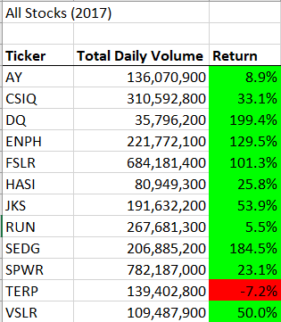
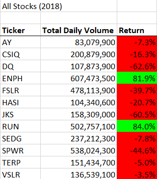

# FACTORS OF SUCCESSFUL KICKSTARTER PROJECTS

## Overview of Project
Steve's clients who are also his parents wanted to invest into DQ New Energy Corp to support alternative energy. However, to make the portfolio safer, Steve wanted to research and analyze various alaternative energy companies to optimize his client's portfolio. 

## Results
### Stock performance in 2017 and 2018
In 2017, all selected energy companies performed well: 4 companies had return rated of more than 100%, 7 companies have return rated from 5% to 53%, and only one company has negative return rate (7.2%). 

In 2018, the result was very different with only two companies that had outperformed (ENPH with 81.9% and RUN with 84%). All other companies had negative returns with the percentages varied from -3.5% to -62.6%. 

### Code performance
Before factoring, the code took more than 0.50 seconds in execution. However, with proper refactoring, the execution times have decreased siginificantly to approximately 0.11 seconds for 2017 stocks and 0.27 seconds for 2018 stocks. 

## Summary
### What are the advantages or disadvantages of refactoring code?

### How do these pros and cons apply to refactoring the original VBA script?

Overview of Project: Explain the purpose of this analysis.
Results: Using images and examples of your code, compare the stock performance between 2017 and 2018, as well as the execution times of the original script and the refactored script.
Summary: In a summary statement, address the following questions.
